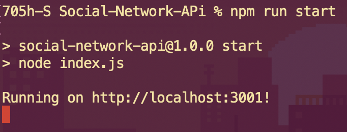
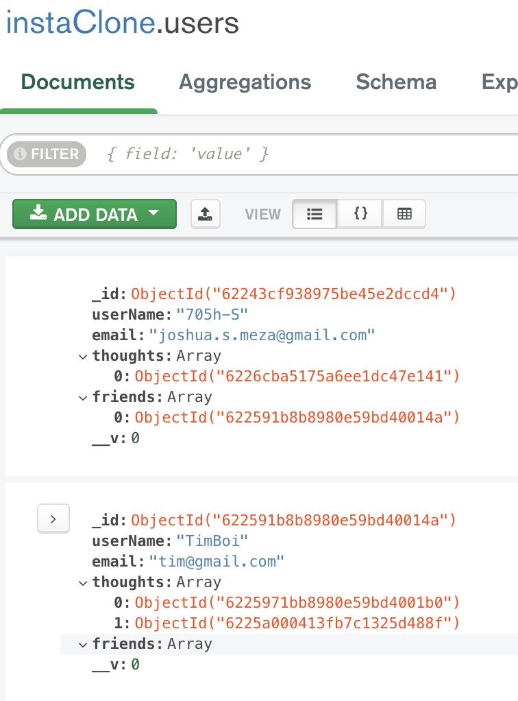
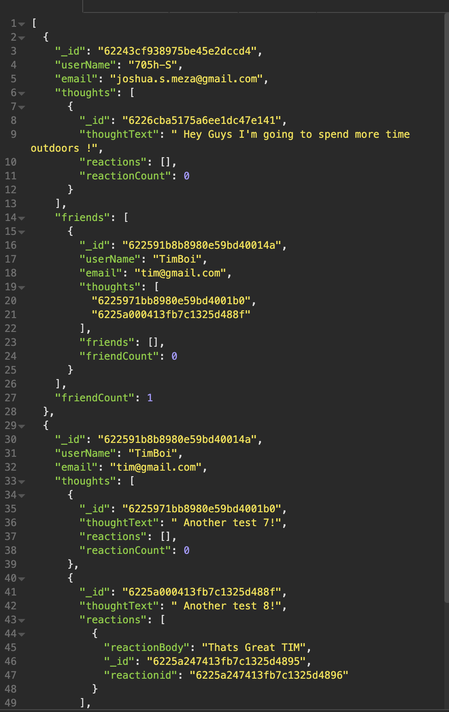
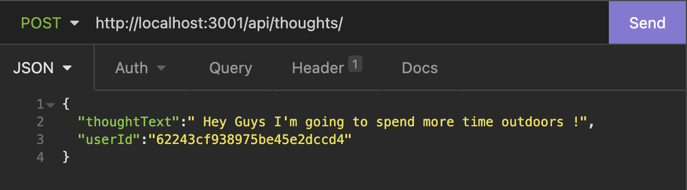

# Social-Network-APi

---

| Table of contents                       |
| --------------------------------------- |
| [Technologies Used](#Technologies-Used) |
| [Description](#Description)             |
| [Installtion](#Installtion)             |
| [Walk-Through](#Walk-Through)           |
| [Routes](#Routes)                       |
| [Images](#Images)                       |
| [Author](#Author)                       |

---

## Technologies Used

- [Node](https://nodejs.dev/)
- [Express](https://www.npmjs.com/package/express)
- [Mongoose](https://mongoosejs.com/)
- [MongoDB](https://www.mongodb.com/)
- [Insomnia](https://insomnia.rest/)

---

## Description

API for a social network web application where users can share their thoughts, react to friends’ thoughts, and create a friend list. I’ll use Express.js for routing, a MongoDB database, and the Mongoose ODM.

---

## Installtion

Before cloning down this repo make sure your [Node](https://nodejs.dev/) is up to date.

For help on How to clone this repo click [here](https://docs.github.com/en/repositories/creating-and-managing-repositories/cloning-a-repository).

Once you have cloned down the repo and are on the correct dictionary on your terminal type in these following commands.

> To install all Node Modules/ dependencies

```
npm i
```

> start the application

```
npm run start
```

After restarting your application you should see message



Using insomnia paste this base URL

```http
http://localhost:3001
```

---

## Walk Through

Video of application running along with it's routes.
<br>
[Walkthrough](https://drive.google.com/file/d/1lb9bofTymn-SQcZPLjm1-55FG-1gnnMw/view)

---

## Routes

With `http://localhost:3001` as our base route here are the methods and parameters.

#### GET Methodes

> Get ALL User

```
http://localhost:3001/api/users
```

> Get ONE user

```
http://localhost:3001/api/users/:userId
```

> Get ALL thoughts

```
http://localhost:3001/api/thoughts
```

> Get ONE THOUGHT

```
http://localhost:3001/api/thoughts/:thoughtId
```

#### POST Methods

> Post(create) a User

```
http://localhost:3001/api/users
```

Body

```JSON
{
	"userName": "Timmy",
	"email": "tim@gmail.com"
}
```

> Post(add) a friend

```
http://localhost:3001/api/users/:userId/friends
```

body

```JSON
{
	"_id":"622591b8b8980e59bd40014a"
}
```

> Post(create) a Thought

```
http://localhost:3001/api/thoughts
```

body

```JSON
{
	"thoughtText":" Hey Guys I'm going to spend more time outdoors !",
	"userId":"62243cf938975be45e2dccd4"
}
```

> Post(Add) a Reaction

```
http://localhost:3001/api/thoughts/:thoughtId/reactions
```

body

```JSON
{
	"reactionBody":"Thats Great TIM",
	"userId": "62243cf938975be45e2dccd4"
}
```

#### PUT Methodes

> Update a user

```
http://localhost:3001/api/users/:userId
```

body

```JSON
{
	"userName": "updated Username",
	"email": "updatedEmail@gmail.com"
}
```

#### DELETE Methodes

> Delete account/user

```
http://localhost:3001/api/users/:userId
```

> Delete Friend

```
http://localhost:3001/api/users/:userId/friends/:friendId
```

> Delete Thought

```
http://localhost:3001/api/thoughts/:thoughtId
```

> Delete Reaction

```
http://localhost:3001/api/thoughts/:thoughtId/reactions/:reactionId
```

---

## Images

Using [Mongo Compass](https://www.mongodb.com/products/compass)
here are the documents


Here's JSON data, this data is for getting all Users


With [Insomnia](https://insomnia.rest/) I'm creating a thought


---

## Author

#### Joshua Meza

[GitHub](https://github.com/705h-S) <br>
[linkedin](https://www.linkedin.com/in/joshua-meza-918b77224/)
